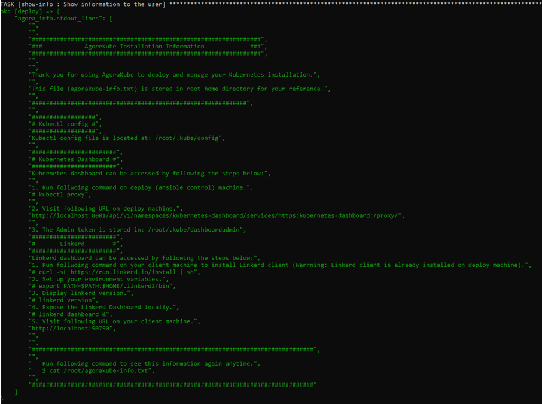

In this tutorial, we will use virtual machines that will be created by vagrant using VirtualBox.

[Vagrant](https://www.vagrantup.com/) is an orchestration tool for building and managing virtual machine environments in a single workflow.

[VirtualBox](https://www.virtualbox.org/) is an Hypervisor Type 2 and it is used to provision Virtual Machines localy.

# Deploy the environment

If you want to deploy the same Kubernetes cluster as this tutorial you will need at least a host with 12GB of RAM, but you can adapt it.

The cluster will be composed of 4 Virtual machines.

* 1 machine Deploy that will be used as a deployment machine. This machine is used to manage your K8S cluster.
* 1 machine master/etcd
* 2 machine worker/storage that are used as worker

> *"Note: If you don't have enough RAM for this tutorial, we suggest deploying an all-in-one cluster (1 machine with all roles). A Vagrantfile is provided for this in the project Agorakube in **./test_lab**

Below you have the Vagrantfile used for this tutorial. We are using 4 machines Ubuntu 18.04. You are free to change the OS to CentOS 7 if you want.

* Create a file named "Vagrantfile" with the following content:

```ruby
#
#	Vagrantfile
#

Vagrant.configure("2") do |config|
    config.vm.box = "bento/ubuntu-18.04"
	
	config.vm.define "deploy" do |deploy|
		deploy.vm.hostname = "deploy"
		deploy.vm.network "private_network", ip: "10.0.0.10"
		deploy.vm.provider "virtualbox" do |v|
			v.memory = 2048
			v.cpus = 1
			v.name = "deploy"
		end
	end
	config.vm.define "master" do |master|
		master.vm.hostname = "master"
		master.vm.network "private_network", ip: "10.0.0.11"
		master.vm.provider "virtualbox" do |v|
			v.memory = 2048
			v.cpus = 1
			v.name = "master"
		end
	end
	config.vm.define "worker1" do |worker1|
		worker1.vm.hostname = "worker1"
		worker1.vm.network "private_network", ip: "10.0.0.12"
		worker1.vm.provider "virtualbox" do |v|
			v.memory = 2048
			v.cpus = 1
			v.name = "worker1"
		end
	end
	config.vm.define "worker2" do |worker2|
		worker2.vm.hostname = "worker2"
		worker2.vm.network "private_network", ip: "10.0.0.13"
		worker2.vm.provider "virtualbox" do |v|
			v.memory = 2048
			v.cpus = 1
			v.name = "worker2"
		end
	end
end
```


## Installation of VMs used in this tutorial

If you want to use the same method of deployment as this tutorial follow those steps.

* Install [VirtualBox](https://www.virtualbox.org/wiki/Downloads)
	* This is necessary to use a version of VirtualBox supported by Vagrant otherwise you will not have the possibility to use the Vagrantfile.
* Install [Vagrant](https://www.vagrantup.com/downloads.html)
	* You can install the latest version
* Deploy the cluster with the Vagrantfile provided below
	* To deploy with the Vagrantfile, create a file Vagrantfile (with no extension!) with the script below
	* Open a command line in the path of this file
	* Use the command ```vagrant up``` (it will start the installation of your machines)
* You can connect to your VMs using ```vagrant ssh NameOfTheMachine```
	* If you want to stop your cluster use the command ```vagrant halt -f```
	* If you want to delete a specific machine ```vagrant delete -f NameOfTheMachine```
	* If you want to delete your cluster ```vagrant delete -f ```

> *"Note: All machines have to be able to communicate to each other."*

The deploy machine has to be able to communicate by SSH with the others machines.


# Setup Agorakube

Now that all your nodes are running, you will be able to setup Agorakube.

1) Connect to you "deploy" node using ```vagrant ssh deploy``` command and then run the following command:

```bash <(curl -s https://raw.githubusercontent.com/ilkilab/Agorakube/master/setup-deploy.sh)```

This command will install Ansible and clone the Agorakube repository on your current path.

2) Next, connect to other Virtual Machines and run the following command on all machines.

```
bash <(curl -s https://raw.githubusercontent.com/ilkilab/Agorakube/master/setup-hosts.sh)
```

This command will update the machine and install the latest version of Python and Openssh-server (Ansible needs Python and SSH to work).


# Create a pair of SSH keys

Agorakube is using Ansible to deploy Kubernetes. Ansible needs an SSH connection to configure the other machines. For that you need to create SSH keys pair. Private key will stay on Deploy machine and public key will be deployed on all machines.

In this part you will create and configure your ssh key pair.

1) Connect to your deploy machine and use the following command to create a SSH key pair.

```
ssh-keygen
```

It will create a Pair of keys that you will use for you SSH connection. **Do not set SSH passphrase !**


I suggest letting everything by default for this tutorial, so you will be able to copy and paste most of the code provided in this tutorial.

By default ssh key pair is generated under "/home/YOUR_USER/.ssh/ . Private key is "id_rsa" and public key is "id_rsa.pub".

Once you have created your SSH key pair, do not forget to push the public key (here id_rsa.pub) in the remote machines in /home/YOUR_USER/.ssh/authorized_keys file. You can use the following command from "deploy" machine to push your  SSH public key to other machines:

```ssh-copy-id vagrant@IP``` (Replace IP with the IP of the remote Host). 

This command will copy the SSH public key located in ~/.ssh/id_rsa.pub to the file /home/vagrant/.ssh/authorized_keys located on the remote host.

**The password for vagrant user is "vagrant".**

## Modify the hosts file


Now, you need to modify the **./hosts** file of Agorakube.
This file is composed of 6 parts:
- **deploy** will provide the name of the deploy machine
- **master** will provide a list of master machines to deploy (from 1 to many - best numbers are [1,3,5]) 
- **etcd** will provide a list of etcd machines to deploy (from 1 to many - best numbers are [1,3,5]) 
- **worker** will provide a list of worker machines to deploy (from 1 to many ) 
- **storage** will provide a list of storage machine to deploy (from 1 to many - best numbers are [1,3,5])

The last block **[all:vars]** is used to declare one IP that is used to publish K8S control plan. (In a production environment this IP is a LoadBalancer that announce K8S masters - port 6443). Other parametres in **[all:vars]** are used to specify how Agorakube/Ansible can connect to cluster machines.

Below the file used for this tutorial. You can modify it with your own specifications.

```ini
[deploy]
deploy ansible_connection=local

[masters]
master  ansible_host=10.0.0.11

[etcd]
master  ansible_host=10.0.0.11

[workers]
worker1  ansible_host=10.0.0.12
worker2  ansible_host=10.0.0.13

[storage]
worker1  ansible_host=10.0.0.12
worker2  ansible_host=10.0.0.13

[all:vars]
advertise_ip_masters=10.0.0.11
ansible_ssh_extra_args='-o StrictHostKeyChecking=no'
ansible_user=vagrant
ansible_ssh_private_key_file=/home/vagrant/.ssh/id_rsa
```
> *"Note: When you declare a machine, you have to use the FQDN."*

# Configure Agorakube Settings

Agorakube is fully customizable. To customize it, modify **./group_vars/all.yaml** file.

You have all information about this file in the [documentation](../main/parameters.md).

You have below the file used for this tutorial:

```
---

# CERTIFICATES
cn_root_ca: ilkilabs
c: FR
st: Ile-De-France
l: Paris
expiry: 87600h
rotate_certs_pki: false
rotate_full_pki: false

# Components version
etcd_release: v3.4.7
kubernetes_release: v1.18.3
delete_previous_k8s_install: False
delete_etcd_install: False
check_etcd_install: True

# IPs-CIDR Configurations
cluster_cidr: 10.33.0.0/16
service_cluster_ip_range: 10.32.0.0/24
kubernetes_service: 10.32.0.1
cluster_dns_ip: 10.32.0.10
service_node_port_range: 30000-32000
kube_proxy_mode: ipvs
kube_proxy_ipvs_algotithm: rr
cni_release: 0.8.5

# Custom features
runtime: containerd
network_cni_plugin: kube-router
flannel_iface: default
ingress_controller: traefik
dns_server_soft: coredns
populate_etc_hosts: yes
k8s_dashboard: True
service_mesh: none
linkerd_release: stable-2.6.0
install_helm: False
init_helm: False
install_kubeapps: False

# Calico
calico_mtu: 1440

# Security
encrypt_etcd_keys:
# Warrning: If multiple keys are defined ONLY LAST KEY is used for encrypt and decrypt.
# Other keys are used only for decrypt purpose
  key1:
    secret: 1fJcKt6vBxMt+AkBanoaxFF2O6ytHIkETNgQWv4b/+Q=

# Data Directory
data_path: "/var/agorakube"
etcd_data_directory: "/var/lib/etcd"
#restoration_snapshot_file: /path/snopshot/file Located on {{ etcd_data_directory }}

# KUBE-APISERVER spec
kube_apiserver_enable_admission_plugins:
# plugin AlwaysPullImage can be deleted. Credentials would be required to pull the private images every time. 
# Also, in trusted environments, this might increases load on network, registry, and decreases speed.
#  - AlwaysPullImages
  - NamespaceLifecycle
# EventRateLimit is used to limit DoS on API server in case of event Flooding
  - EventRateLimit
  - LimitRanger
  - ServiceAccount
  - TaintNodesByCondition
  - PodNodeSelector
  - Priority
  - DefaultTolerationSeconds
  - DefaultStorageClass
  - StorageObjectInUseProtection
  - PersistentVolumeClaimResize
  - MutatingAdmissionWebhook
  - NodeRestriction
  - ValidatingAdmissionWebhook
  - RuntimeClass
  - ResourceQuota
# SecurityContextDeny should be replaced by PodSecurityPolicy
#  - SecurityContextDeny


# Rook Settings
enable_rook: False
rook_dataDirHostPath: /data/rook

# Minio Settings
# Minio Key MUST BE Base64 encoded and Rook MUST be enabed.
enable_rook_minio: False
rook_minio_infra_access_key: admin_minio
rook_minio_infra_secret_key: password_minio


# Monitoring. Rook MUST be enabled to use monitoring (Monitoring use StorageClass to persist data)
enable_monitoring: False


# Enable Harbor Registry - Contain Chartmuseum, notary, clair, registry.
# Harbor will be expose by HTTPS with Ingress Resource.
# Rook MUST be enabled to use Harbor (Harbor use StorageClass to persist data)
install_harbor: False
harbor_ingress_host: harbor.ilkilabs.io
notary_ingress_host: notary.ilkilabs.io
harbor_admin_password: ChangeMe!
```

# Deploy K8S with Agorakube

Now that your K8S cluster is defined and configured in ".hosts" and "./groug_vars/all.yaml" files you are ready to run the Agorakube installation.

Run the followinf command:
```
sudo ansible-playbook agorakube.yaml
```

The installation prosses can take a wile to complite, so just wait.

At the end of installation, you must see the following screen:

<p align="center"> 
</p>


> *Note: If some errors occures, juste run again the agorakube installation. Agorakube installation process is idempotent.*

# Play with kubernetes

Oncee Agorakube has been succefully installed you can use your kubernetes cluster to deploy and manage your apps.

By default, "kubectl" is configured **only for root user on deploy machine**

## Connect to kubernetes

1) Connect to your Deploy machine and then become root with the following command ```sudo su```

2) Now, list all your nodes with the following command : ```kubectl get nodes -o wide```

3) List all your pods with following command : ```kubectl get pods --all-namespaces -o wide```

4) List all your K8S control plan services with : ```kubectl get cs```

Note: The best way to manage Kubernetes cluster is not from the deploy machine itself, but from a client machine (For exemple your computer/laptop). You should [install kubectl on your computer](https://kubernetes.io/docs/tasks/tools/install-kubectl/) and download the kubeconfig file located in "deploy" machine at "/root/.kube/config".
