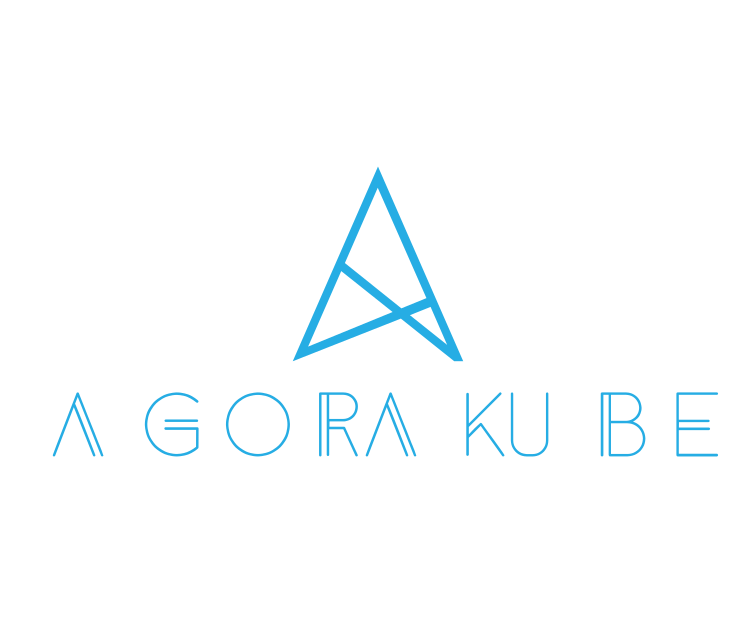

  

  

This project is aimed to provide the simplest way to install kubernetes on bare-metal, virtual & Cloud environments. 

Currently, Ubuntu 18.04 (Bionic) amd64 and Centos 7/8 are supported, but several other operating systems will be available soon. 

Since November 2019, Agorakube has been certified by the "Kubernetes Conformance Program" and is a project of [the cncf landscape](https://landscape.cncf.io/selected=agora-kube).
