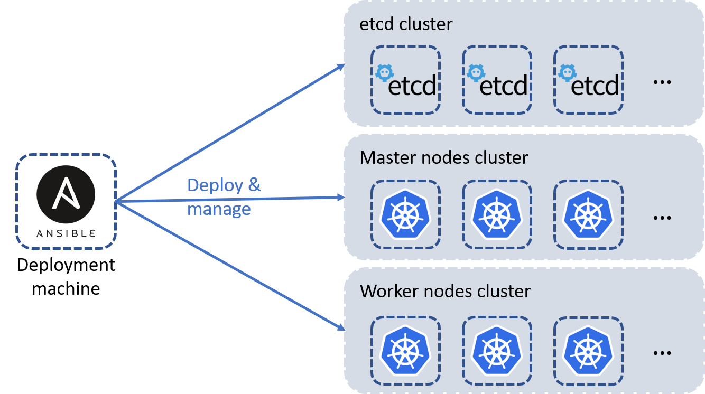

# Table of Contents
This is a list of points that will be explained in this instructions file for the AgoraKube project :

- [High-level Architecture](#high-level-architecture)
- [Prerequisites](#prerequisites)
- [Nodes Setup](#nodes-setup)
- [K8S Cluster Configuration](#k8s-cluster-configuration)
- [Agorakube Parameters](#agorakube-parameters)
- [Kubernetes deployment](#kubernetes-deployment)


# High-level Architecture

Below a diagram of the high-level architecture deployed by AgoraKube :


**Notes :** This distibution is aimed to be customizable so you can choose :
 
* Where the **etcd** will be deployed (with the master or not) 
* The number of **master** nodes to deploy (from 1 to many)
* The number of **etcd** nodes to deploy (from 1 to many)
* The number of **worker** nodes to deploy (from 1 to many)
 
# Prerequisites

This section explains what are the prerequisites to install AgoraKube in your environment.

## OS

Below the OS currently supported on all the machines :

* Ubuntu 18.04 (Bionic) - amd64
* Centos 7 & 8 - amd64
  
## Node Sizing

Below the sizing prerequisites for all the nodes (master and worker) :

* 2 GB or more of RAM per machine
* 2 CPUs or more
* Full network connectivity between all machines in the cluster (public or private network is fine)
* Full internet access
* Unique hostname, MAC address, and product_uuid for every node. See here for more [details](https://kubernetes.io/docs/setup/production-environment/tools/kubeadm/install-kubeadm/#verify-the-mac-address-and-product-uuid-are-unique-for-every-node).
* Certain ports are open on your machines. See here for more [details](https://kubernetes.io/docs/setup/production-environment/tools/kubeadm/install-kubeadm/#check-required-ports).
* Swap disabled. You MUST disable swap in order for the kubelet to work properly.

Below the sizing prerequisites for the deployment machine :

* 2 GB or more of RAM
* 1 CPU or more
* Full network connectivity between all machines in the cluster (public or private network is fine)
* Full internet access

# Nodes Setup

This section explains how to setup notes before deploying Kubernetes Clusters with AgoraKube.

## Deployment node

The deployment node is an Ansible server which contains all Ansible roles and variables used to deploy and configure Kubernetes Clusters with AgoraKube distribution.

- Connect to the deployment node and run the following command :
```
bash <(curl -s https://raw.githubusercontent.com/ilkilab/agorakube/master/setup-deploy.sh)
```


## K8S nodes

The K8S nodes will host all the components needed for a Kubernetes cluster Control and Data planes.

The prerequisites are:

* SSH Server (like Openssh)
* Python2

You can run the following command to automatically install those packages :
```
bash <(curl -s https://raw.githubusercontent.com/ilkilab/agorakube/master/setup-hosts.sh)
```

## SSH keys creation

Agorakube is using Ansible to deploy Kubernetes. You have to configure SSH keys to ensure the communication between the deploy machine and the others.

On the deploy machine, create the SSH keys :
```
ssh-keygen
```
You can let everything by default.

When your keys are created, you have to copy the public key in the other machine in the folder /home/yourUser/.ssh/authorized_keys, or you can use the following commands to copy the key :
```
ssh-copy-id -i .ssh/id_rsa.pub yourUser@IP_OF_THE_HOST
```
You have to execute this command for each node of your cluster

Once your ssh keys have been pushed to all nodes, modify the file "agorakube/hosts" to add the user/ssh-key (in section **SSH Connection settings**) that Agorakube will use to connect to all nodes

# K8S Cluster Configuration

AgoraKube enables an easy way to deploy and manage customizable K8S clusters.

## Inventory file

The first file to modify is **"./hosts"**. This file contains all architecture information about your K8S Cluster.

**All K8S servers names must be filled in by their FQDN.**

The next Sample deploys K8S components in HA mode on 6 nodes (3 **etcd/masters** nodes and 3 **workers** nodes) :

```
[deploy]
k8s-7.novalocal ansible_connection=local

[masters]
k8s-1.novalocal  ansible_host=10.20.20.4
k8s-2.novalocal  ansible_host=10.20.20.5
k8s-3.novalocal  ansible_host=10.20.20.8
#deploy.novalocal ansible_connection=local ip=10.20.20.8
[etcd]
k8s-1.novalocal  ansible_host=10.20.20.4
k8s-2.novalocal  ansible_host=10.20.20.5
k8s-3.novalocal  ansible_host=10.20.20.8
#deploy.novalocal ansible_connection=local ip=10.20.20.8
[workers]
k8s-4.novalocal  ansible_host=10.20.20.9
k8s-5.novalocal  ansible_host=10.20.20.11
k8s-6.novalocal  ansible_host=10.20.20.10
#deploy.novalocal ansible_connection=local ip=10.20.20.8

[all:vars]
advertise_ip_masters=84.39.47.56

# SSH connection settings
ansible_ssh_extra_args='-o StrictHostKeyChecking=no'
ansible_user=cloud
ansible_ssh_private_key_file=/tmp/private.pem
```

The **deploy** section contains information about how to connect to the deployment machine.

The **etcd** section contains information about the etcd machine(s) instances.

The **masters** section contains information about the masters nodes (K8S Control Plane).

The **workers** section contains information about the workers nodes (K8S Data Plane).

The **all:vars** section contains information about how to connect to K8S nodes.

The **SSH Connection settings** section contain information about the SSH connexion. You have to modify the variable **ansible_ssh_private_key_file** with the path where your public key is stored.
**ansible_user** User used as service account by Agorakube to connect to all nodes. **User must be sudoer**.

## Configuration file

The **"./group_vars/all.yaml"** file contains all configuration variables that you can customize to make your K8S Cluster fit your needs.

Sample file will deploy **containerd** as container runtime, **flannel** as CNI plugin and **coredns** as DNS service : 

```
---

# CERTIFICATES
cn_root_ca: ilkilabs
c: FR
st: Ile-De-France
l: Paris
expiry: 87600h


# Components version
etcd_release: v3.4.3
kubernetes_release: v1.17.1
delete_previous_k8s_install: False

# IPs-CIDR Configurations
cluster_cidr: 10.33.0.0/16
service_cluster_ip_range: 10.32.0.0/24
kubernetes_service: 10.32.0.1
cluster_dns_ip: 10.32.0.10
service_node_port_range: 30000-32767
kube_proxy_mode: ipvs
kube_proxy_ipvs_algotithm: rr


# Custom features
runtime: containerd
network_cni_plugin: flannel
flannel_iface: default
ingress_controller: traefik
dns_server_soft: coredns
populate_etc_hosts: yes
k8s_dashboard: true
update_certs: false
service_mesh: linkerd
linkerd_release: stable-2.6.0
install_helm: false
init_helm: false
install_kubeapps: false

# Calico
calico_mtu: 1440

# Security
encrypt_key_etcd: 1fJcKt6vBxMt+AkBanoaxFF2O6ytHIkETNgQWv4b/+Q=

# Data Directory
data_path: "/var/agorakube"
```

**Note :** You can also modify the IPs-CIDR if you want.

# Kubernetes deployment

Once all configuration files are set, run the following command to launch the Ansible playbook that will deploy the pre-configured Kubernetes cluster :

```
sudo ansible-playbook agorakube.yaml
```

